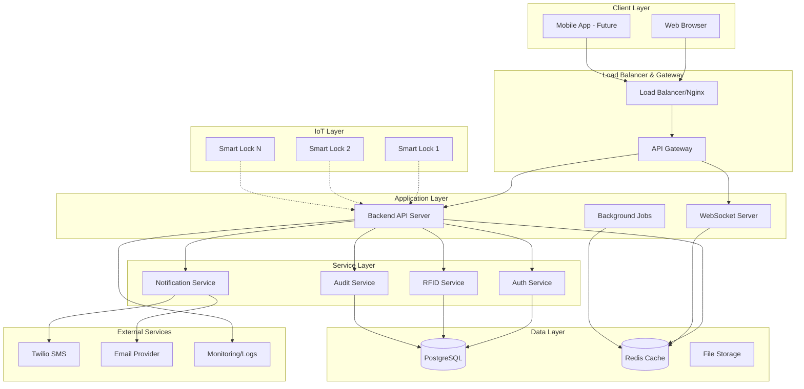
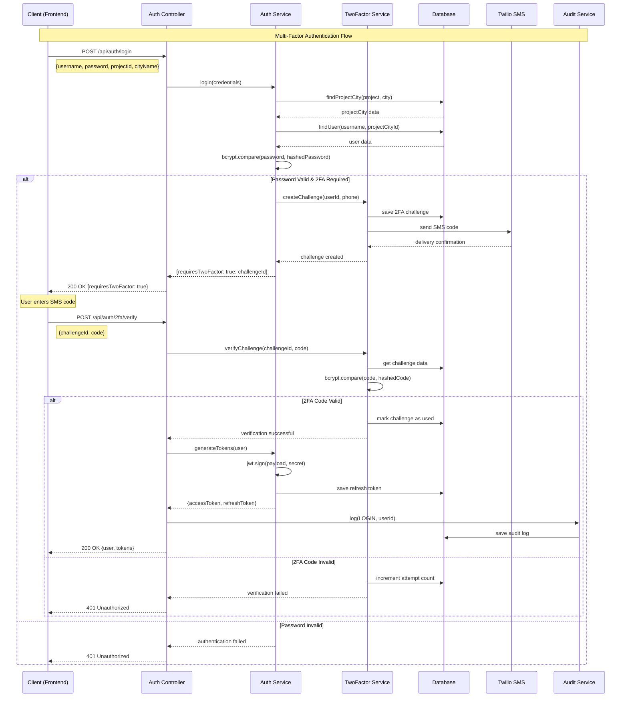
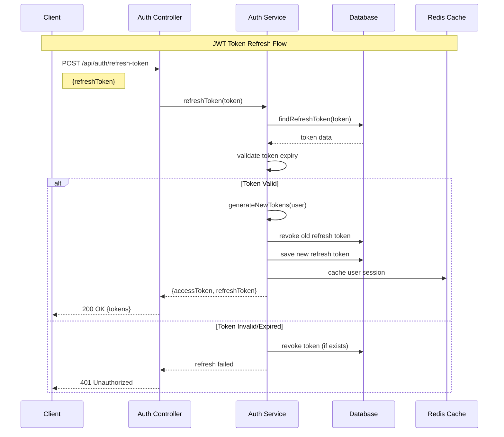
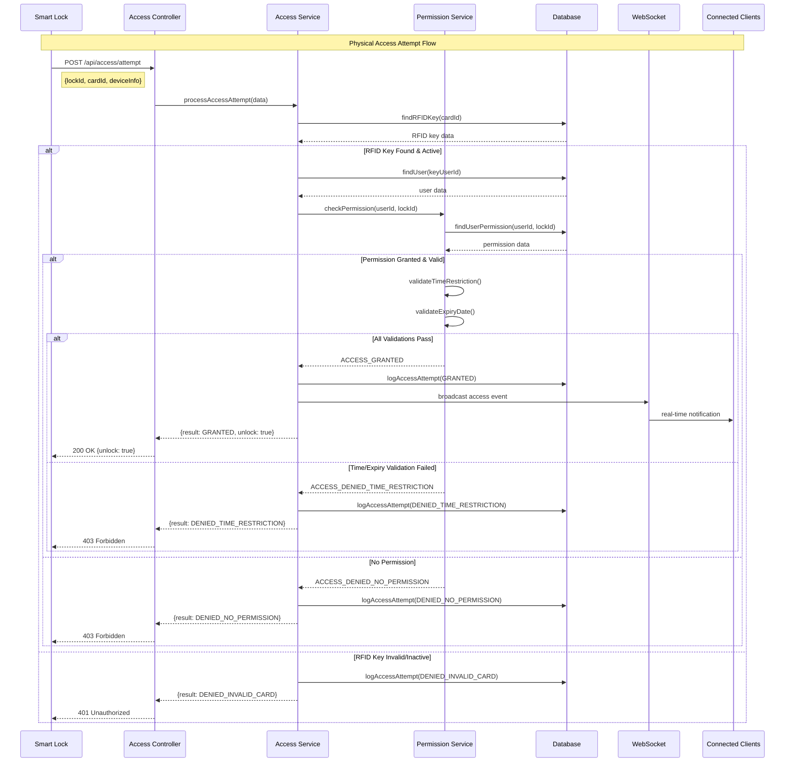
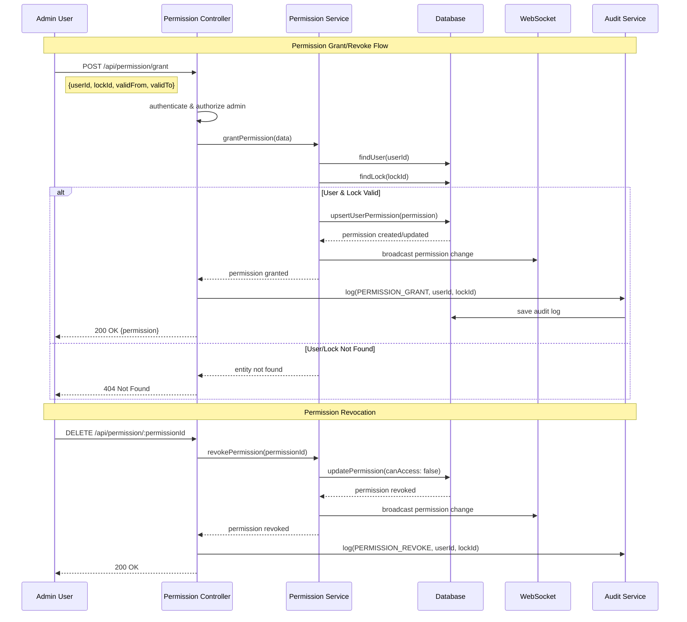
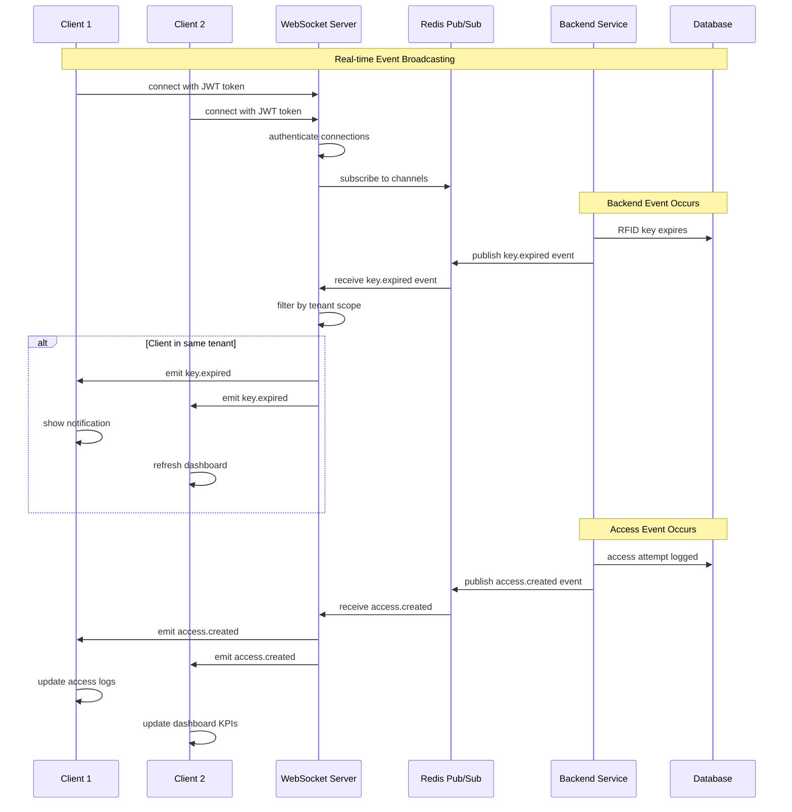
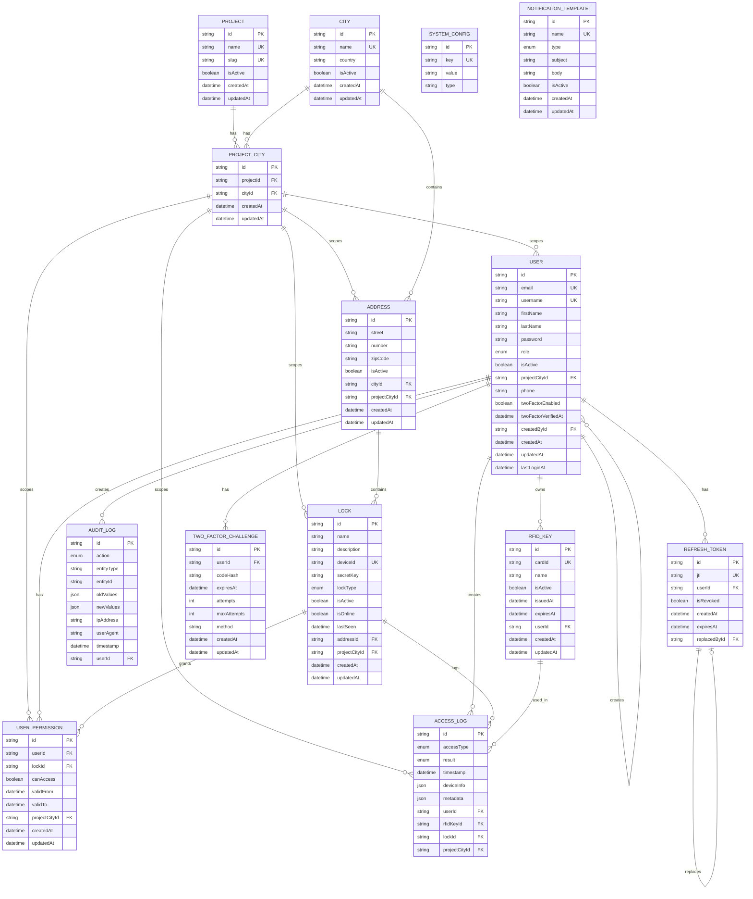
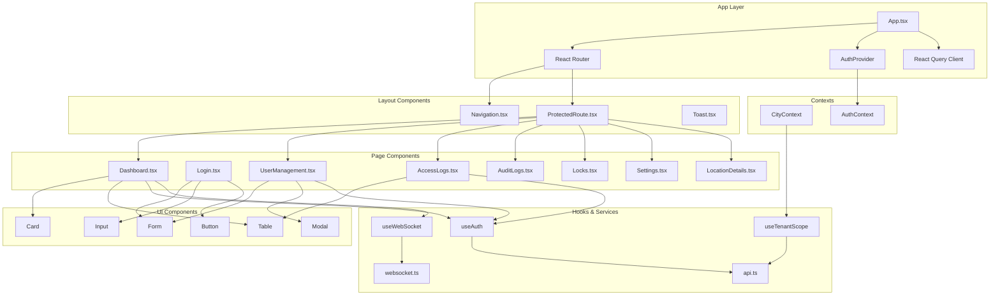
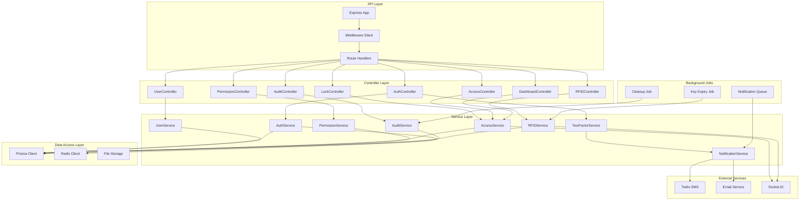
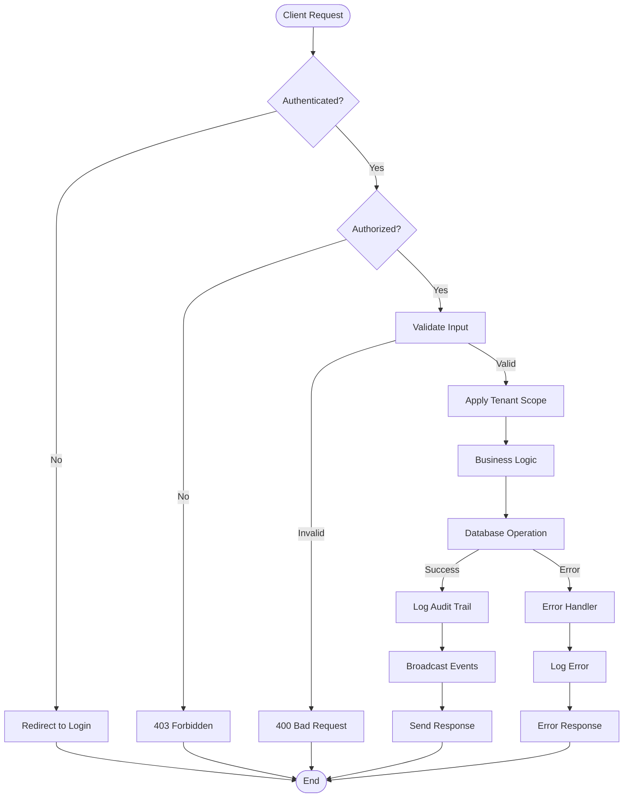

# 🏗️ RFID Asset Access Control System - Architecture Diagrams

**Generated on:** September 22, 2025  
**Repository:** MadihDev/asset-access-control  
**Branch:** main

This document provides comprehensive system architecture diagrams including sequence diagrams, class diagrams, and system interaction flows for the RFID Asset Access Control System.

## 📋 Table of Contents

1. [System Overview](#system-overview)
2. [Authentication & Authorization Flows](#authentication--authorization-flows)
3. [Access Control Sequences](#access-control-sequences)
4. [Real-time Communication](#real-time-communication)
5. [Class Diagrams](#class-diagrams)
6. [Database Entity Relationships](#database-entity-relationships)
7. [Component Architecture](#component-architecture)

---

## 🌐 System Overview

### High-Level Architecture Diagram



---

## 🔐 Authentication & Authorization Flows

### 1. User Login with 2FA Sequence



### 2. Token Refresh Flow



---

## 🚪 Access Control Sequences

### 1. RFID Key Access Attempt



### 2. User Permission Management



---

## 🔄 Real-time Communication

### WebSocket Event Broadcasting



---

## 📊 Class Diagrams

### 1. Authentication Domain

```mermaid
classDiagram
    class AuthController {
        +login(req: Request, res: Response): Promise~void~
        +logout(req: Request, res: Response): Promise~void~
        +refreshToken(req: Request, res: Response): Promise~void~
        +verify2FA(req: Request, res: Response): Promise~void~
        +resend2FA(req: Request, res: Response): Promise~void~
        +changePassword(req: Request, res: Response): Promise~void~
        +getProfile(req: Request, res: Response): Promise~void~
    }

    class AuthService {
        -jwtSecret: string
        -jwtExpiresIn: string
        -refreshExpiresIn: string
        +login(loginData: LoginRequest): Promise~LoginResponse~
        +logout(userId: string): Promise~void~
        +validateToken(token: string): Promise~User~
        +refreshToken(refreshToken: string): Promise~TokenResponse~
        +changePassword(userId: string, data: ChangePasswordRequest): Promise~void~
        +resetPassword(email: string): Promise~void~
        -generateTokens(user: User): TokenPair
        -generateJWT(payload: JWTPayload): string
    }

    class TwoFactorService {
        -CODE_LENGTH: number
        -DEFAULT_TTL_SEC: number
        -DEFAULT_MAX_ATTEMPTS: number
        +createChallenge(userId: string, phone: string): Promise~TwoFactorChallengeResponse~
        +verifyChallenge(challengeId: string, code: string): Promise~TwoFactorVerificationResult~
        +resendChallenge(challengeId: string): Promise~TwoFactorChallengeResponse~
        +cleanupExpiredChallenges(): Promise~void~
        -generateCode(): string
        -sendSMSCode(phone: string, code: string): Promise~void~
    }

    class User {
        +id: string
        +email: string
        +username: string
        +firstName: string
        +lastName: string
        +password: string
        +role: UserRole
        +isActive: boolean
        +projectCityId?: string
        +phone?: string
        +twoFactorEnabled: boolean
        +twoFactorVerifiedAt?: DateTime
        +createdAt: DateTime
        +updatedAt: DateTime
        +lastLoginAt?: DateTime
    }

    class RefreshToken {
        +id: string
        +jti: string
        +userId: string
        +isRevoked: boolean
        +expiresAt: DateTime
        +createdAt: DateTime
        +replacedById?: string
    }

    class TwoFactorChallenge {
        +id: string
        +userId: string
        +codeHash: string
        +expiresAt: DateTime
        +attempts: number
        +maxAttempts: number
        +method: string
        +createdAt: DateTime
        +updatedAt: DateTime
    }

    AuthController --> AuthService
    AuthController --> TwoFactorService
    AuthService --> User
    AuthService --> RefreshToken
    TwoFactorService --> User
    TwoFactorService --> TwoFactorChallenge
    User ||--o{ RefreshToken : "has many"
    User ||--o{ TwoFactorChallenge : "has many"
```

### 2. Access Control Domain

```mermaid
classDiagram
    class AccessController {
        +processAccess(req: Request, res: Response): Promise~void~
        +getAccessLogs(req: Request, res: Response): Promise~void~
        +exportAccessLogs(req: Request, res: Response): Promise~void~
    }

    class AccessService {
        +processAccessAttempt(data: AccessAttemptRequest): Promise~AccessResult~
        +logAccess(logData: AccessLogData): Promise~AccessLog~
        +getAccessLogs(filters: AccessLogFilters): Promise~AccessLog[]~
        +exportAccessLogs(filters: AccessLogFilters): Promise~string~
        -validateAccessPermission(userId: string, lockId: string): Promise~boolean~
        -checkTimeRestrictions(permission: UserPermission): boolean
    }

    class PermissionService {
        +grantPermission(data: GrantPermissionRequest): Promise~UserPermission~
        +revokePermission(permissionId: string): Promise~void~
        +getUserPermissions(userId: string): Promise~UserPermission[]~
        +getLockPermissions(lockId: string): Promise~UserPermission[]~
        +checkAccess(userId: string, lockId: string): Promise~AccessCheckResult~
        +bulkGrantPermissions(data: BulkPermissionRequest): Promise~UserPermission[]~
        +bulkRevokePermissions(userIds: string[], lockIds: string[]): Promise~void~
    }

    class RFIDService {
        +assignKey(data: AssignKeyRequest): Promise~RFIDKey~
        +revokeKey(keyId: string): Promise~void~
        +getUserKeys(userId: string): Promise~RFIDKey[]~
        +validateKey(cardId: string): Promise~RFIDKey | null~
        +processKeyExpiry(): Promise~void~
        +bulkAssignKeys(data: BulkAssignRequest): Promise~RFIDKey[]~
    }

    class Lock {
        +id: string
        +name: string
        +description?: string
        +deviceId: string
        +secretKey: string
        +lockType: LockType
        +isActive: boolean
        +isOnline: boolean
        +lastSeen?: DateTime
        +addressId: string
        +projectCityId?: string
        +createdAt: DateTime
        +updatedAt: DateTime
    }

    class RFIDKey {
        +id: string
        +cardId: string
        +name?: string
        +isActive: boolean
        +issuedAt: DateTime
        +expiresAt?: DateTime
        +userId: string
        +createdAt: DateTime
        +updatedAt: DateTime
    }

    class UserPermission {
        +id: string
        +userId: string
        +lockId: string
        +canAccess: boolean
        +validFrom: DateTime
        +validTo?: DateTime
        +projectCityId?: string
        +createdAt: DateTime
        +updatedAt: DateTime
    }

    class AccessLog {
        +id: string
        +accessType: AccessType
        +result: AccessResult
        +timestamp: DateTime
        +deviceInfo?: Json
        +metadata?: Json
        +userId?: string
        +rfidKeyId?: string
        +lockId: string
        +projectCityId?: string
    }

    AccessController --> AccessService
    AccessController --> PermissionService
    AccessService --> RFIDService
    AccessService --> Lock
    AccessService --> AccessLog
    PermissionService --> UserPermission
    RFIDService --> RFIDKey

    User ||--o{ UserPermission : "has many"
    User ||--o{ RFIDKey : "has many"
    Lock ||--o{ UserPermission : "has many"
    Lock ||--o{ AccessLog : "has many"
    RFIDKey ||--o{ AccessLog : "has many"
    User ||--o{ AccessLog : "has many"
```

### 3. Multi-Tenant Architecture

```mermaid
classDiagram
    class Project {
        +id: string
        +name: string
        +slug: string
        +isActive: boolean
        +createdAt: DateTime
        +updatedAt: DateTime
    }

    class City {
        +id: string
        +name: string
        +country: string
        +isActive: boolean
        +createdAt: DateTime
        +updatedAt: DateTime
    }

    class ProjectCity {
        +id: string
        +projectId: string
        +cityId: string
        +createdAt: DateTime
        +updatedAt: DateTime
    }

    class Address {
        +id: string
        +street: string
        +number: string
        +zipCode: string
        +isActive: boolean
        +cityId: string
        +projectCityId?: string
        +createdAt: DateTime
        +updatedAt: DateTime
    }

    class TenantScopeService {
        +getEffectiveProjectCityId(req: Request): string | undefined
        +getUserScope(user: User): string | undefined
        +validateTenantAccess(user: User, resourceId: string): boolean
        +applyScopeFilter(query: any, scope: string): any
    }

    Project ||--o{ ProjectCity : "has many"
    City ||--o{ ProjectCity : "has many"
    ProjectCity ||--o{ User : "scopes"
    ProjectCity ||--o{ Address : "scopes"
    ProjectCity ||--o{ Lock : "scopes"
    ProjectCity ||--o{ UserPermission : "scopes"
    ProjectCity ||--o{ AccessLog : "scopes"
    City ||--o{ Address : "contains"
    Address ||--o{ Lock : "contains"

    TenantScopeService --> ProjectCity
    TenantScopeService --> User
```

---

## 🗄️ Database Entity Relationships

### Complete ERD



---

## 🧩 Component Architecture

### Frontend Component Hierarchy



### Backend Service Architecture



---

## 🔄 Data Flow Diagrams

### Request-Response Flow



---

This comprehensive diagram documentation provides a complete technical overview of the RFID Asset Access Control System architecture, covering all major components, interactions, and data flows. The diagrams are designed to be both technically accurate and visually clear for developers, architects, and stakeholders.

## 📚 Diagram Legend

- **Solid arrows**: Direct method calls or data flow
- **Dashed arrows**: Asynchronous operations or events
- **Rectangles**: Components/Services
- **Diamonds**: Decision points
- **Cylinders**: Data stores
- **Circles**: Start/End points

---

**Document Version:** 1.0  
**Last Updated:** September 22, 2025  
**Maintained By:** Development Team
