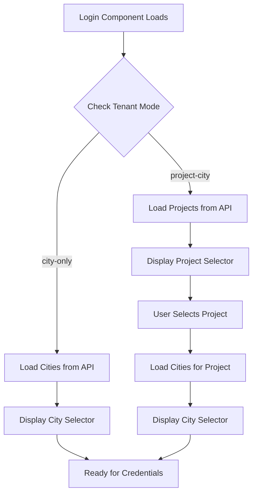
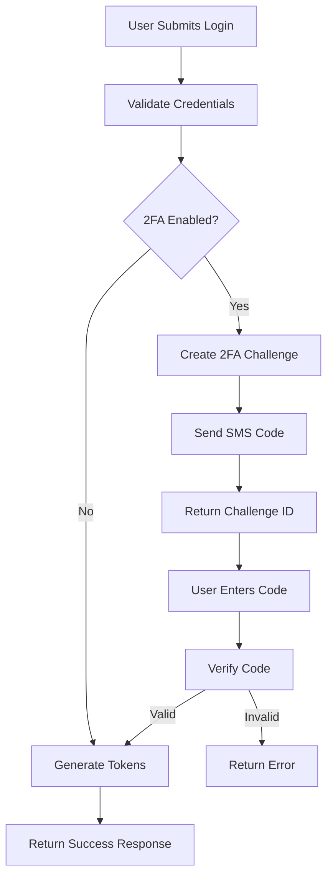

# Login Page Workflow Documentation

## Overview

The RFID Access Control System supports a sophisticated multi-tenant login workflow that handles both legacy city-only mode and modern project-city mode authentication. This document details the complete login flow from the frontend interface to backend authentication.

## System Architecture

### Authentication Components

- **Frontend**: React Login component (`Login.tsx`)
- **Authentication Context**: React context for auth state management (`AuthContext.tsx`)
- **Backend API**: Express.js authentication endpoints (`/api/auth/login`)
- **Authentication Service**: Core business logic (`auth.service.ts`)
- **Database**: PostgreSQL with Prisma ORM

## Tenant Modes

The system operates in two distinct tenant modes:

### 1. Project-City Mode (Recommended)

- **Description**: Multi-tenant architecture with project and city hierarchy
- **Selection Flow**: User selects Project → City → Credentials
- **Use Case**: Modern deployments with multiple organizations and cities

### 2. City-Only Mode (Legacy)

- **Description**: Single-tenant architecture with city-only scoping
- **Selection Flow**: User selects City → Credentials
- **Use Case**: Legacy deployments and simple setups

## Frontend Login Workflow

### 1. Component Initialization



### 2. User Input Flow

#### Project-City Mode

1. **Project Selection**

   - User selects from available projects
   - Frontend fetches cities for selected project
   - Form updates to show city dropdown

2. **City Selection**

   - User selects city within chosen project
   - Selection persisted in TenantContext
   - Form validation enables credential fields

3. **Credential Entry**
   - Username (not email)
   - Password
   - Form validates all fields are complete

#### City-Only Mode

1. **City Selection**

   - User selects from all available cities
   - No project hierarchy

2. **Credential Entry**
   - Username and password
   - City selection required for scoping

### 3. Form Submission Process

```typescript
// Login form submission logic
const handleSubmit = async (e: React.FormEvent) => {
  e.preventDefault();
  setLoading(true);
  setError("");

  try {
    // Persist city selection for session scoping
    localStorage.setItem("cityId", formData.cityId);

    // Prepare credentials based on tenant mode
    const credentials: LoginCredentials = {
      username: formData.username,
      password: formData.password,
    };

    if (mode === "project-city" && formData.project) {
      // Project-city mode: send project name and city name
      credentials.projectId = projectName;
      credentials.cityName = cityName;
    } else {
      // Legacy mode: send city ID
      credentials.cityId = formData.cityId;
    }

    // Delegate to AuthContext for API call
    await login(credentials);
  } catch (error) {
    // Handle authentication errors
    setError(errorMessage);
  } finally {
    setLoading(false);
  }
};
```

## Backend Authentication Workflow

### 1. Authentication Endpoint

**Route**: `POST /api/auth/login`

**Request Validation**:

- Username: Required, 3-50 characters
- Password: Required, minimum 6 characters
- City/Project: Required based on tenant mode

### 2. Authentication Service Logic

```typescript
async login(loginData: LoginRequest): Promise<LoginResponse> {
  const { username, password, cityId, projectId, cityName } = loginData

  let user: any = null
  let resolvedProjectCityId: string | undefined = undefined

  // Mode-specific user lookup
  if (isProjectCityMode() && projectId && cityName) {
    // Project-city mode: find by project and city names
    const projectCity = await prisma.projectCity.findFirst({
      where: {
        project: { name: projectId },
        city: { name: cityName }
      }
    })

    if (!projectCity || !projectCity.project.isActive) {
      throw new Error('Invalid project or city')
    }

    // Find user by username and projectCityId
    user = await prisma.user.findFirst({
      where: { username, projectCityId: projectCity.id }
    })

  } else if (cityId) {
    // Legacy mode: find by city ID
    const city = await prisma.city.findUnique({ where: { id: cityId } })
    if (!city || !city.isActive) {
      throw new Error('Invalid city')
    }

    // Dual read mode: try projectCityId first, fallback to cityId
    user = await findUserWithFallback(username, cityId)
  }

  // Validate user and credentials
  if (!user || !user.isActive) {
    throw new Error('Invalid credentials or account deactivated')
  }

  const isPasswordValid = await bcrypt.compare(password, user.password)
  if (!isPasswordValid) {
    throw new Error('Invalid credentials')
  }

  // Generate JWT tokens
  const tokens = await this.generateTokensForUser(user.id)

  return {
    user: sanitizedUser,
    accessToken: tokens.accessToken,
    refreshToken: tokens.refreshToken,
    expiresIn: tokens.expiresIn
  }
}
```

### 3. Token Generation

```typescript
async generateTokensForUser(userId: string) {
  const user = await prisma.user.findUnique({ where: { id: userId } })

  // JWT payload with user context
  const payload: JWTPayload = {
    userId: user.id,
    username: user.username,
    role: user.role,
    cityId: user.cityId,
    projectCityId: user.projectCityId
  }

  // Generate access token (short-lived)
  const accessToken = jwt.sign(payload, this.jwtSecret, {
    expiresIn: this.jwtExpiresIn // Default: 24h
  })

  // Generate refresh token (long-lived)
  const refreshToken = crypto.randomUUID()
  const expiresAt = new Date(Date.now() + 7 * 24 * 60 * 60 * 1000) // 7 days

  // Store refresh token in database
  await prisma.refreshToken.create({
    data: {
      token: refreshToken,
      userId: user.id,
      expiresAt
    }
  })

  return {
    accessToken,
    refreshToken,
    expiresIn: 86400 // 24 hours in seconds
  }
}
```

## Two-Factor Authentication (2FA) Flow

### 2FA Integration Points

The system includes a complete 2FA infrastructure that can be integrated into the login flow:



### 2FA Endpoints

#### Verify 2FA Code

**Route**: `POST /api/auth/2fa/verify`

```typescript
{
  "challengeId": "uuid-v4-challenge-id",
  "code": "123456"
}
```

#### Resend 2FA Code

**Route**: `POST /api/auth/2fa/resend`

```typescript
{
  "challengeId": "uuid-v4-challenge-id"
}
```

## Frontend Authentication State Management

### AuthContext Implementation

```typescript
interface AuthContextValue {
  user: AuthUser | null;
  loading: boolean;
  login: (credentials: LoginCredentials) => Promise<void>;
  logout: () => void;
}

// Login implementation
const login = useCallback(async (credentials: LoginCredentials) => {
  const { data } = await api.post("/api/auth/login", credentials);

  // Store tokens
  localStorage.setItem("token", data.data.accessToken);
  localStorage.setItem("refreshToken", data.data.refreshToken);

  // Update auth state
  setUser(data.data.user as AuthUser);
}, []);
```

### Token Management

1. **Access Token Storage**: Stored in localStorage as 'token'
2. **Refresh Token Storage**: Stored in localStorage as 'refreshToken'
3. **Automatic Refresh**: Handled by axios interceptors
4. **Token Validation**: Profile endpoint validates token on app load

## Error Handling

### Common Error Scenarios

1. **Invalid Credentials**

   - Message: "Invalid credentials"
   - Status: 401
   - Action: Display error, allow retry

2. **Inactive Account**

   - Message: "Account is deactivated"
   - Status: 401
   - Action: Contact administrator

3. **Invalid Project/City**

   - Message: "Invalid project or city"
   - Status: 400
   - Action: Refresh project/city data

4. **Network Connectivity**

   - Message: "Cannot reach API at {baseUrl}"
   - Status: Network error
   - Action: Check network connection

5. **Validation Errors**
   - Message: Field-specific validation messages
   - Status: 400
   - Action: Fix form validation issues

### Error Display

```typescript
// Frontend error handling
{
  error && (
    <div className="bg-red-50 border border-red-200 text-red-700 px-4 py-3 rounded-md">
      {error}
    </div>
  );
}
```

## Demo Credentials

### Project-City Mode

- **PerfectIT Admin**: username=perfectit_admin, password=password123, project=PerfectIT Solutions, city=Amsterdam
- **PerfectIT User**: username=perfectit_user, password=password123, project=PerfectIT Solutions, city=Rotterdam
- **Acme Admin**: username=acme_admin, password=password123, project=Acme Corporation, city=Amsterdam
- **Acme User**: username=acme_user, password=password123, project=Acme Corporation, city=Utrecht

### City-Only Mode (Legacy)

- **Admin**: username=admin, password=password123, city=Amsterdam
- **Manager**: username=manager, password=password123, city=Rotterdam
- **Supervisor**: username=supervisor, password=password123, city=The Hague
- **User**: username=user1, password=password123, city=Utrecht

## Security Features

### Password Security

- Bcrypt hashing with salt rounds
- Minimum password requirements
- Password change functionality

### Token Security

- JWT with expiration
- Refresh token rotation
- Secure token storage considerations

### Session Management

- Automatic token refresh
- Graceful logout handling
- Session persistence across browser restarts

### Audit Logging

- Login attempts logged
- User activities tracked
- Security events recorded

## API Response Formats

### Successful Login Response

```json
{
  "success": true,
  "data": {
    "user": {
      "id": "user-uuid",
      "email": "user@example.com",
      "firstName": "John",
      "lastName": "Doe",
      "role": "USER",
      "cityId": "city-uuid",
      "projectCityId": "project-city-uuid"
    },
    "accessToken": "jwt-access-token",
    "refreshToken": "uuid-refresh-token",
    "expiresIn": 86400
  },
  "message": "Login successful"
}
```

### Error Response

```json
{
  "success": false,
  "error": "Invalid credentials"
}
```

### Validation Error Response

```json
{
  "success": false,
  "error": "Validation failed",
  "details": [
    {
      "field": "username",
      "message": "Username is required"
    }
  ]
}
```

## Configuration

### Environment Variables

#### Backend (.env)

```bash
JWT_SECRET=your-secret-key
JWT_EXPIRES_IN=24h
JWT_REFRESH_EXPIRES_IN=7d
TENANT_MODE=project-city
```

#### Frontend (.env)

```bash
VITE_API_URL=http://localhost:5000
VITE_TENANT_MODE=project-city
VITE_ALLOW_DEMO_LOGIN=true
```

## Testing

### Unit Tests Coverage

- ✅ Authentication service logic
- ✅ Login component functionality
- ✅ Error handling scenarios
- ✅ Token management
- ✅ 2FA integration points

### Integration Tests

- ✅ End-to-end login flow
- ✅ Multi-tenant authentication
- ✅ Token refresh mechanism
- ✅ Error response handling

## Future Enhancements

### Planned Features

1. **2FA Integration**

   - SMS verification codes
   - Email backup codes
   - TOTP authenticator support

2. **Social Authentication**

   - OAuth integration
   - SSO provider support

3. **Advanced Security**

   - Rate limiting per user
   - Account lockout policies
   - Password complexity requirements

4. **User Experience**
   - Remember me functionality
   - Biometric authentication
   - Multi-device management

## Troubleshooting

### Common Issues

1. **Port Mismatch**

   - Frontend expects backend on port 5000
   - Check VITE_API_URL configuration

2. **CORS Issues**

   - Ensure ALLOWED_ORIGIN includes frontend URL
   - Check preflight request handling

3. **Token Expiration**

   - Implement proper refresh logic
   - Handle expired token scenarios

4. **Database Connection**
   - Verify PostgreSQL connectivity
   - Check Prisma configuration

For additional support, refer to the [Technical Report](../TECHNICAL_REPORT.md) and [Architecture Documentation](../ARCHITECTURE.md).
