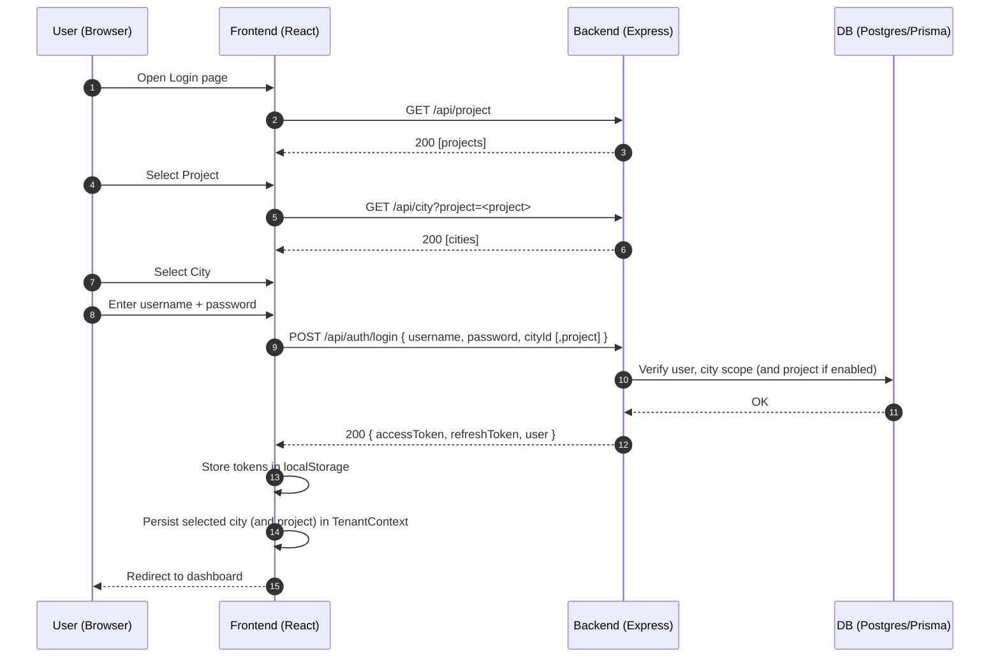
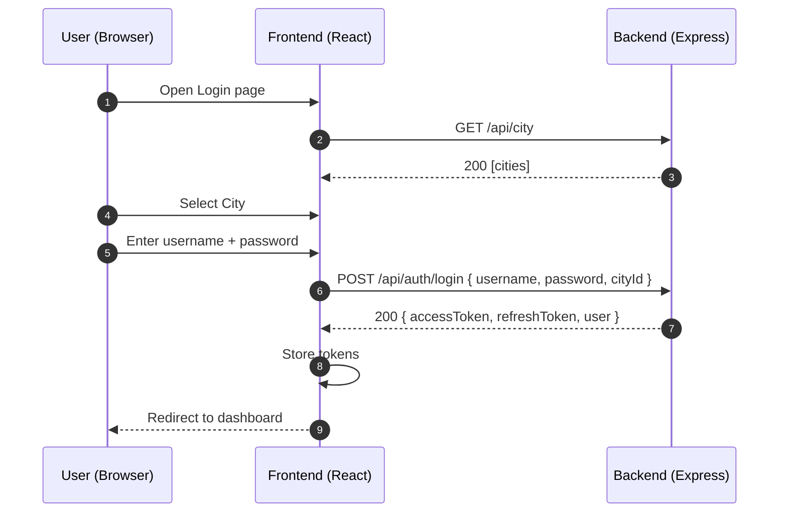

# Login Flow (Frontend ↔ Backend)

This document explains how the login works in both tenant modes and how tokens are handled on the frontend.

- Frontend: React + Vite app in `rfid-frontend`
- Backend: Express API in `backend`
- Base URL: Read from `VITE_API_URL` (dev default `http://localhost:5001`)

## 1) High-level sequence (Project+City mode)



## 2) High-level sequence (City-only mode)



## 3) Frontend login component flow

```mermaid
flowchart TD
  A[Login.tsx mounted] -->|mode=project-city| B[refresh(): fetch projects + cities]
  A -->|mode=city-only| C[fetch /api/city]
  B --> D[User selects project]
  D --> E[Fetch /api/city?project=<project>]
  E --> F[User selects city]
  C --> F
  F --> G[Enter username + password]
  G --> H[Submit]
  H --> I[POST /api/auth/login]
  I -->|200| J[Store tokens in localStorage]
  J --> K[Save cityId (and project) to TenantContext]
  K --> L[Navigate to dashboard]
  I -->|401/err| M[Show error; if demo enabled and creds match demo → mock login]
```

Notes:

- Tenant mode banner is shown at the top of the login card.
- Footer shows the resolved API base URL: `api.defaults.baseURL` or `import.meta.env.VITE_API_URL`.

## 4) Token handling and auto-refresh

```mermaid
sequenceDiagram
  participant F as Frontend (Axios)
  participant B as Backend

  F->>B: Any API request with Authorization: Bearer <accessToken>
  alt Access token valid
    B-->>F: 200 OK
  else Access token expired (401)
    F->>F: Axios response interceptor intercepts 401
    F->>B: POST /api/auth/refresh-token { refreshToken }
    alt Refresh OK
      B-->>F: 200 { accessToken, refreshToken }
      F->>F: Update localStorage tokens
      F->>B: Retry original request with new accessToken
      B-->>F: 200 OK
    else Refresh fails
      F->>F: Clear tokens; redirect to login
    end
  end
```

## 5) Backend endpoints involved

- `GET /api/health` – health check.
- `POST /api/auth/login` – login; validates city (+ project in project-city mode); returns tokens.
- `POST /api/auth/refresh-token` – returns new tokens.
- `GET /api/project` – list projects (project-city mode).
- `GET /api/city` – list cities, optionally filtered by `project`.

## 6) API base URL resolution (Frontend)

Priority used by the frontend client (`src/services/api.ts`):

- `import.meta.env.VITE_API_URL` if set
- otherwise default to `http://localhost:5001`

On the login screen footer we display the URL the client is using so devs can verify configuration.

## 7) Error messages shown on login

- Network errors: “Cannot reach API at <baseURL>”.
- Validation errors: Combined messages from backend `details` array.
- Generic failure: “Login failed”.
- Optional demo mode: if `VITE_ALLOW_DEMO_LOGIN === 'true'` and demo creds match, a mock token is set for quick demos.

---

Tips:

- For dev, set `rfid-frontend/.env.local` → `VITE_API_URL=http://localhost:5001`.
- Mode is controlled by `VITE_TENANT_MODE` (`city-only` | `project-city`).
- The footer on the login page shows the effective base URL to avoid confusion.
